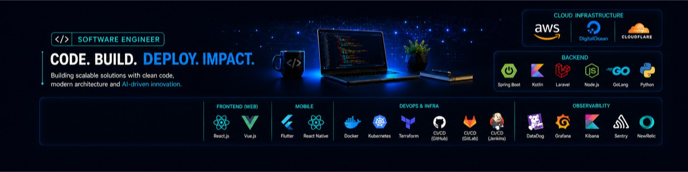

  

Senior Software Engineer from Bauru, Sao Paulo, Brazil, with 15+ years of experience building scalable software, integrating systems, and turning business needs into reliable products.

I enjoy working close to product and engineering teams, balancing clean architecture, pragmatic delivery, automation, and long-term maintainability. My background spans backend development, web applications, platform tooling, integrations, testing, and cloud-friendly systems.

## What I Work With

- Backend engineering, APIs, integrations, and distributed systems
- Web applications, browser extensions, and internal tools
- System design, maintainability, refactoring, and technical decisions
- Automation, scripting, containers, CI/CD, and developer experience
- Agile delivery, mentoring, collaboration, and product-minded engineering

## Main Stack

**Languages**

  
  
  
  
  
  

**Backend & Web**

  
  
  
  
  
  

**Data & Infrastructure**

  
  
  
  
  
  
  
  
  

## Languages

- Portuguese: native
- English: professional working proficiency

## Contact

<!-- Replace YOUR_EMAIL_HERE with the public email address you want to expose. -->

  
  
  

